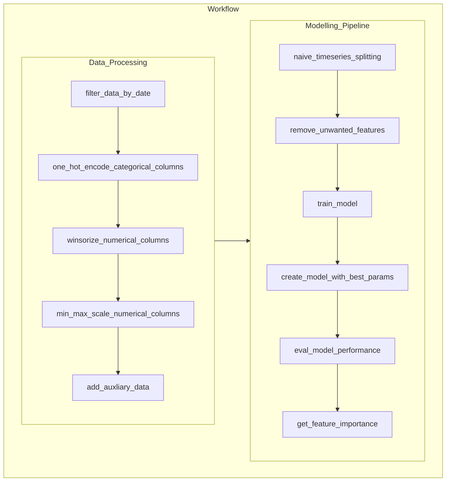

# End-to-end credit default prediction for public firms

## Summary
This project is implemented with modification from the `Probability of Default` white paper published by the National University of Singapore. The intention is to build a binary classificaiton model to predict the credit default status given the relevant features identified

## Model Inputs:

#### Macro-Financial Factors:
- `Stock Index Return`: Trailing 1-year return of the primary stock market, winsorized and currency adjusted
- `Short-term Risk-Free Rate`: Yield on 3 month government bills
- `Economy-level Distance-To-Default for financial firms` & `Economy-level Distance-To-Default for non-financial firms`: Median Distance-to-Default of financial/non-financial firms in each economy inclusive of those foreign firms whose primary stock exchange is in this economy (Not applicable to China) 

#### Firm-Specific Attributes:
- `Distance-to-Default (level)` & `Distance-to-Default (trend)`: Volatility-adjusted leverage based on Merton (1974) with special treatments
- `Cash/Total Assets (level)` & `Cash/Total Assets (trend)`: For financial firm’s liquidity - Logarithm of the ratio of each firm’s sum of cash and short-term investments to total assets
- `Current Assets/Current Liabilities (level)` & `Current Assets/Current Liabilities (level)`: For non-financial firm’s liquidity - Logarithm of the ratio of each firm’s current assets to current liabilities
- `Net Income/Total Assets (level)` & `Net Income/Total Assets (trend)`: Profitability - Ratio of each firm’s net income to total assets 
- `Relative Size (level)` & `Relative Size (trend)`: Logarithm of the ratio of each firm’s market capitalization to the economy’s median market capitalization over the past one year
- `Relative Market-to-Book Ratio`: Individual firm’s market misvaluation/ future growth opportunities relative to the economy’s median level of market-to-book ratio
- `Idiosyncratic Volatility`: 1-year idiosyncratic volatility of each firm, computed as the standard deviation of its residuals using the market model

## Workflow Diagram:
**Remark**: 
- Certain trivial functions are omitted to save space
- Hyperparameter tuning through Optuna are done within the `train_model` function
- For more details, please look at the docstring within each class and function

