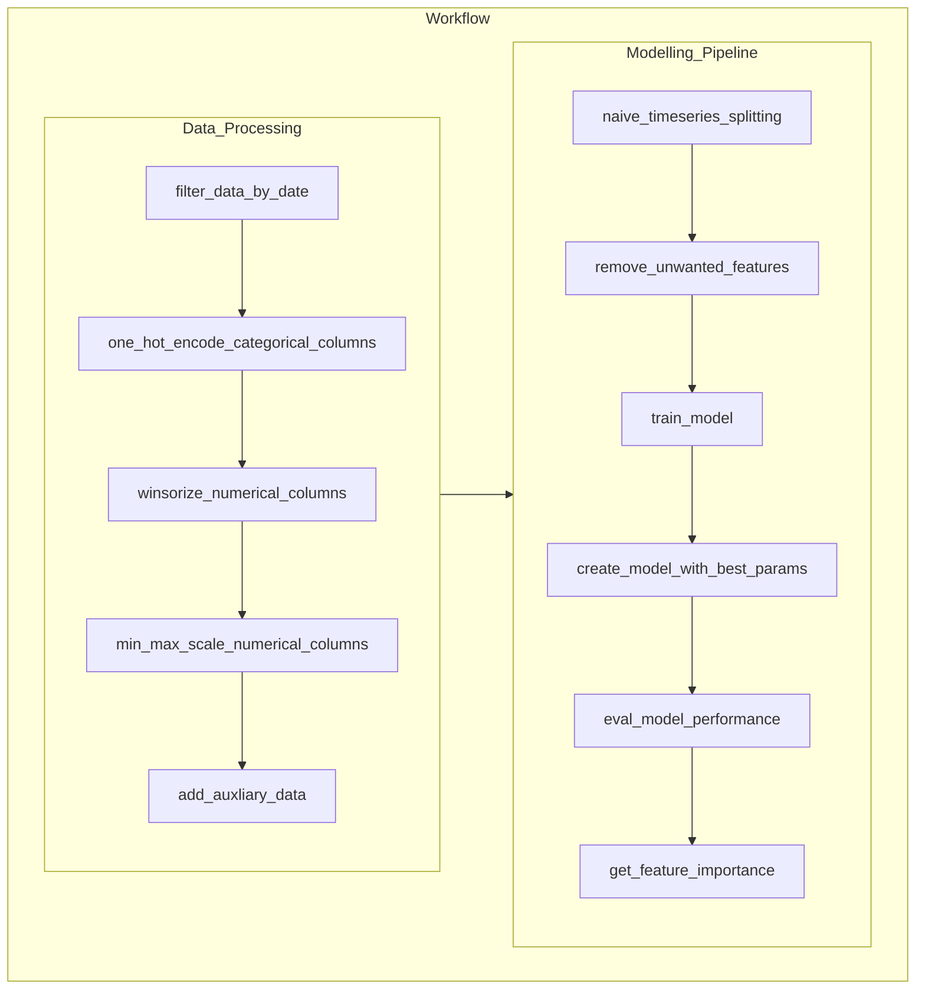

## Summary
This project is implemented with modification from the `Probability of Default` white paper published by the National University of Singapore. The intention is to build a binary classificaiton model to predict the credit default status given the relevant features identified

## Folder Structure:
Remark: files saved in mlruns (mlflow experiments for finding the best model) are omitted in the following diagram

|-- config|
|   |-- catalog.yaml
|-- data
|   |-- processed
|       |-- processed_input.csv
|   |-- raw
|       |-- input.csv
|-- notebooks
|   |-- scratchpad.ipynb
|-- src
|   |-- utils
|       |-- data_schema.py
|       |-- general_utility_functions.py
|   |-- __init__.py
|   |-- data_processing.py
|   |-- extract_financial_data.py
|   |-- hyperparameter_tuning.py
|   |-- main.py
|   |-- model_pipeline.py
|-- tests
|   |-- __init__.py
|   |-- test_data_processing.py
|   |-- test_extract_financial_data.py
|   |-- test_model_pipeline.py
|-- .gitignore
|-- .pre-commit-config.yaml
|-- poetry.lock
|-- pyproject.toml
|-- README.md

## Model Inputs:

#### Macro-Financial Factors:
- `Stock Index Return`: Trailing 1-year return of the primary stock market, winsorized and currency adjusted
- `Short-term Risk-Free Rate`: Yield on 3 month government bills
- `Economy-level Distance-To-Default for financial firms` & `Economy-level Distance-To-Default for non-financial firms`: Median Distance-to-Default of financial/non-financial firms in each economy inclusive of those foreign firms whose primary stock exchange is in this economy (Not applicable to China) 

#### Firm-Specific Attributes:
- `Distance-to-Default (level)` & `Distance-to-Default (trend)`: Volatility-adjusted leverage based on Merton (1974) with special treatments
- `Cash/Total Assets (level)` & `Cash/Total Assets (trend)`: For financial firm’s liquidity - Logarithm of the ratio of each firm’s sum of cash and short-term investments to total assets
- `Current Assets/Current Liabilities (level)` & `Current Assets/Current Liabilities (level)`: For non-financial firm’s liquidity - Logarithm of the ratio of each firm’s current assets to current liabilities
- `Net Income/Total Assets (level)` & `Net Income/Total Assets (trend)`: Profitability - Ratio of each firm’s net income to total assets 
- `Relative Size (level)` & `Relative Size (trend)`: Logarithm of the ratio of each firm’s market capitalization to the economy’s median market capitalization over the past one year
- `Relative Market-to-Book Ratio`: Individual firm’s market misvaluation/ future growth opportunities relative to the economy’s median level of market-to-book ratio
- `Idiosyncratic Volatility`: 1-year idiosyncratic volatility of each firm, computed as the standard deviation of its residuals using the market model

## High Level Workflow Diagram:
**Remark**: 
- Certain trivial functions are omitted to save space
- Hyperparameter tuning through Optuna are done within the `train_model` function
- For more details, please look at the docstring within each class and function

## Processing and Modelling Logic:
1. Schema validation on the input data using **Pandera**
   - Checks if the input columns are of the correct dtypes
   - Coerce if they are not, e.g., Date is stored as string instead of datetime/timestamp 

2. Data Extraction from Yahoo Finance:
   - `get_data` downloads the pricing data into a pandas dataframe
   - `fill_missing_dates` creates a dataframe using the min and max of the input data as the range parameters. Merge with the pricing data fetched to fill dates which no transaction occurred.
   - `calculate_returns` Do a forward for the closing prices of the dates filled and then calculate the daily return
   - `extraction_flow` connects the preceding functions together in a flow

3. Data Processing class function:
   - `filter_data_by_date` filters out data prior to 2000s as recency bias is expected. It can also reduce the risk of data (distribution) drift.
   - `one_hot_encode_categorical_columns` applys encoding to the categorical variable industry classification code using pd.get_dummies
   - `winsorize_numerical_columns` loops through all the column names, if they are of numeric in nature, apply winsorization
   - `min_max_scale_numerical_columns` applys min max scaling by initializing the MinMaxScaler from sklearn.preprocessing. It should not matter for variables that are already encoded.
   - `fetch_auxiliary_data` fetches the Oil (BZ=F) closing price from yfinance API
   - `add_auxiliary_data` merges the processed input dataframe with the Oil pricing data from Yahoo Finance
   - `process_flow` links all the preceding steps together in a flow