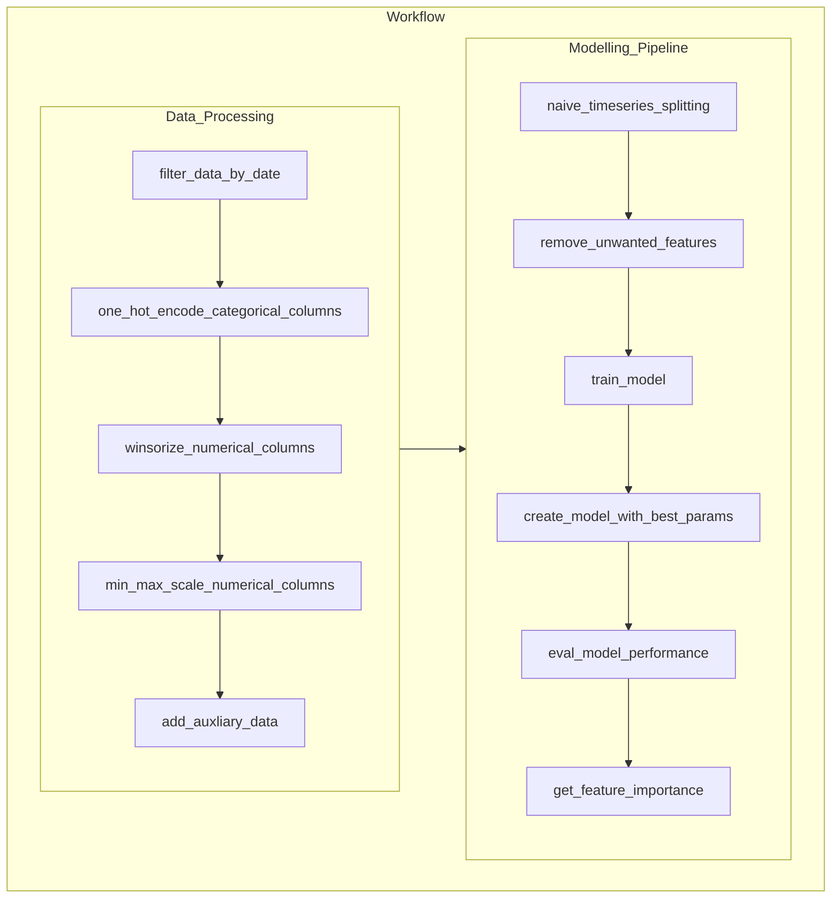
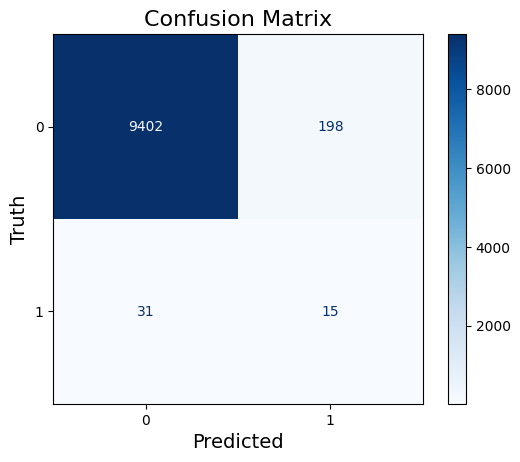
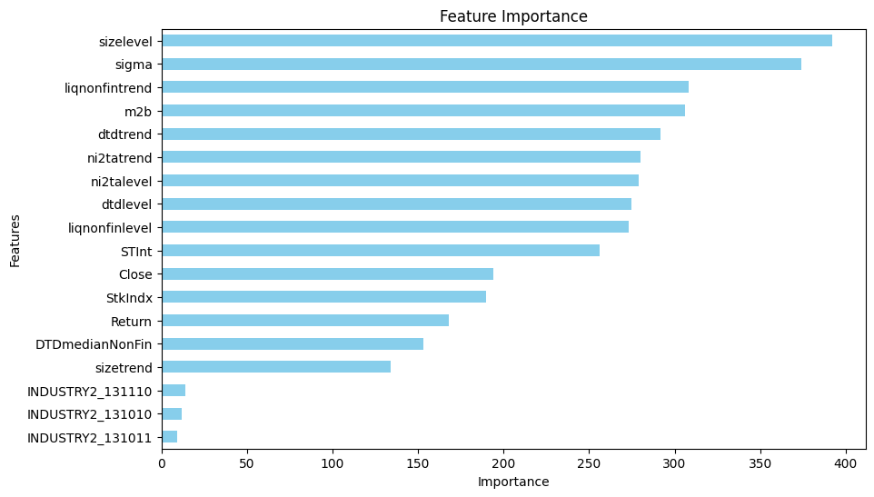

## Summary
This project is implemented with modification from the `Probability of Default` white paper published by the National University of Singapore. The intention is to build a binary classificaiton model to predict the credit default status given the relevant features identified

## Folder Structure:
Remark: files saved in **mlruns** folder (mlflow artifacts and loggings) are omitted in the following diagram
```
|-- config|
|   |-- catalog.yaml
|-- data
|   |-- processed
|       |-- processed_input.csv
|   |-- raw
|       |-- input.csv
|-- models
|   |-- lgbm_model.pkl
|-- notebooks
|   |-- scratchpad.ipynb
|-- output
|   |-- best_param.json
|   |-- confusion_matrix.png
|   |-- feature_importance.png
|-- screenshots
|   |-- Screenshot 2024-03-01 at 1.27.31 PM.png
|   |-- Screenshot 2024-03-01 at 1.28.00 PM.png
|   |-- Screenshot 2024-03-03 at 2.29.12 PM.png
|   |-- Screenshot 2024-03-03 at 2.44.18 PM PM.png
|-- src
|   |-- utils
|       |-- data_schema.py
|       |-- general_utility_functions.py
|   |-- __init__.py
|   |-- data_processing.py
|   |-- extract_financial_data.py
|   |-- hyperparameter_tuning.py
|   |-- main.py
|   |-- model_pipeline.py
|-- tests
|   |-- __init__.py
|   |-- test_data_processing.py
|   |-- test_extract_financial_data.py
|   |-- test_model_pipeline.py
|-- .gitignore
|-- .pre-commit-config.yaml
|-- poetry.lock
|-- pyproject.toml
|-- README.md
```

## Exploratory Analysis / Variable Profiling:
 

The relevant code can be found in the scratchpad.ipynb or profiling_report.py (streamlit)

## Model Inputs:

| Category | Attribute | Description |
| --- | --- | --- |
| Macro-Financial Factors | `Stock Index Return` | Trailing 1-year return of the primary stock market, winsorized and currency adjusted |
| Macro-Financial Factors | `Short-term Risk-Free Rate` | Yield on 3 month government bills |
| Macro-Financial Factors | `Economy-level Distance-To-Default for financial firms` | Median Distance-to-Default of financial firms in each economy inclusive of those foreign firms whose primary stock exchange is in this economy (Not applicable to China) |
| Macro-Financial Factors | `Economy-level Distance-To-Default for non-financial firms` | Median Distance-to-Default of non-financial firms in each economy inclusive of those foreign firms whose primary stock exchange is in this economy (Not applicable to China) |
| Firm-Specific Attributes | `Distance-to-Default (level)` | Volatility-adjusted leverage based on Merton (1974) with special treatments |
| Firm-Specific Attributes | `Distance-to-Default (trend)` | Volatility-adjusted leverage based on Merton (1974) with special treatments |
| Firm-Specific Attributes | `Cash/Total Assets (level)` | For financial firm’s liquidity - Logarithm of the ratio of each firm’s sum of cash and short-term investments to total assets |
| Firm-Specific Attributes | `Cash/Total Assets (trend)` | For financial firm’s liquidity - Logarithm of the ratio of each firm’s sum of cash and short-term investments to total assets |
| Firm-Specific Attributes | `Current Assets/Current Liabilities (level)` | For non-financial firm’s liquidity - Logarithm of the ratio of each firm’s current assets to current liabilities |
| Firm-Specific Attributes | `Current Assets/Current Liabilities (trend)` | For non-financial firm’s liquidity - Logarithm of the ratio of each firm’s current assets to current liabilities |
| Firm-Specific Attributes | `Net Income/Total Assets (level)` | Profitability - Ratio of each firm’s net income to total assets |
| Firm-Specific Attributes | `Net Income/Total Assets (trend)` | Profitability - Ratio of each firm’s net income to total assets |
| Firm-Specific Attributes | `Relative Size (level)` | Logarithm of the ratio of each firm’s market capitalization to the economy’s median market capitalization over the past one year |
| Firm-Specific Attributes | `Relative Size (trend)` | Logarithm of the ratio of each firm’s market capitalization to the economy’s median market capitalization over the past one year |
| Firm-Specific Attributes | `Relative Market-to-Book Ratio` | Individual firm’s market misvaluation/ future growth opportunities relative to the economy’s median level of market-to-book ratio |
| Firm-Specific Attributes | `Idiosyncratic Volatility` | 1-year idiosyncratic volatility of each firm, computed as the standard deviation of its residuals using the market model |


Remark: 
One possible data quality issue could be that the min of <u>total assets</u> before scaling goes to negative.Having a negative total asset value would **contradict the fundamental principle of what assets represent**

## High Level Workflow Diagram:
**Remark**: 
- Certain trivial functions are omitted to save space
- Hyperparameter tuning through Optuna are done within the `train_model` function
- For more details, please look at the docstring within each class and function



## Processing and Modelling Logic:
1. Schema validation on the input data using **Pandera**
   - Checks if the input columns are of the correct dtypes
   - Coerce if they are not, e.g., Date is stored as string instead of datetime/timestamp 

2. Data Extraction from Yahoo Finance:
   - `get_data` downloads the pricing data into a pandas dataframe
   - `fill_missing_dates` creates a dataframe using the min and max of the input data as the range parameters. Merge with the pricing data fetched to fill dates which no transaction occurred.
   - `calculate_returns` Do a forward for the closing prices of the dates filled and then calculate the daily return
   - `extraction_flow` connects the preceeding functions together in a flow

3. Data Processing class function:
   - `filter_data_by_date` filters out data prior to 2000s as recency bias is expected. It can also reduce the risk of data (distribution) drift.
   - `one_hot_encode_categorical_columns` applys encoding to the categorical variable industry classification code using pd.get_dummies
   - `winsorize_numerical_columns` loops through all the column names, if they are of numeric in nature, apply winsorization
   - `min_max_scale_numerical_columns` applys min max scaling by initializing the MinMaxScaler from sklearn.preprocessing. It should not matter for variables that are already encoded.
   - `fetch_auxiliary_data` fetches the Oil (BZ=F) closing price from yfinance API
   - `add_auxiliary_data` merges the processed input dataframe with the Oil pricing data from Yahoo Finance
   - `process_flow` links all the preceeding steps together in a flow
  
4. Model Pipeline class function:
   - `naive_timeseries_splitting` splits the training, validation and test dataset according to date range requirements
   - `remove_unwanted_features` removes ["Company_name", "Date", "CompNo", "indicator"] from all the datasets
   - `train_model` Calls the hyperparametertuning class, tune the parameters based on the objective initialize the model with the best params
   - `create_model_with_best_params` fits the model on training data and save it as a pickle file
   - `eval_model_performance` calls the self.evaluate_set method to evaluate the model performance on both the validation and test set
   - `evaluate_set` outputs a metric dictionary
   - `generate_confusion_matrix` generates a confusion matrix and saves the plot to the output folder
   - `get_feature_importance` outputs the absolute feature importance, plots the bar chart and saves it to the output folder
   - `run_pipeline` links all the preceeding methods together in a flow

5. Hyperparameter Tuner class function:
   - `create_or_get_experiment` creates or gets an optuna experiment with assigned name
   - `log_model_and_params` logs the model, params and metrics for each experiment
   - `objective` defines the objective function, e.g. maximizing roc_auc or pr_auc
   - `create_optuna_study` chains the preceeding steps together as an optuna workflow

## Tuning results on validation set:
 

## Model Evaluation & Interpretation:
Interpreting the acceptability of a PR AUC score should always be **contextual**, especially in scenarios involving **highly imbalanced dataset** where accurately predicting the minority class poses a significant challenge. Achieving even a modest improvement in PR AUC can be a difficult endeavor. Nevertheless, a low PR AUC score may still hold considerable value, particularly when evaluating the **relative costs of false positives versus false negatives**. In the realm of default prediction, <u>overlooking a potential default (a false negative) can be significantly more detrimental than mistakenly flagging a loan as a risk (a false positive)</u>. The financial repercussions of failing to identify a default are substantial. Therefore, a model with a modest PR AUC that nonetheless manages to enhance the detection of actual defaults (improving recall) compared to a basic model which overemphasize on accuracy can offer critical insights and lead to better outcome. Recognizing the limitations of both the model and the data, **integrating the expertise of subject matter experts** can further refine and validate the predictive insights, bridging gaps and enhancing decision-making processes.

Best combination of parameters: ```{"lambda_l1": 8.873255298337503, "lambda_l2": 4.727427102367874, "num_leaves": 9, "feature_fraction": 0.685297914889198, "bagging_fraction": 0.704314019446759, "bagging_freq": 4, "min_child_samples": 157, "learning_rate": 0.10382116330923424, "max_depth": 8, "min_split_gain": 0.042754101835854964, "scale_pos_weight": 46.660042583392475, "n_estimators": 148}```

<u>*Note that the trade off between pr_auc and accuracy below are intentional by using a very aggresive scale_pos_weight*</u>

Validation set:
If the tuning objective is to **maximize roc_auc**: ```{'accuracy': 0.9050626761247692, 'f1': 0.9168619433615146, 'pr_auc': 0.37202374319668213, 'roc_auc': 0.8796414359644725}```

If the tuning objective is to **maximize pr_auc**: ```{'accuracy': 0.7943834418423865, 'f1': 0.8462647285044139, 'pr_auc': 0.3553108109863231, 'roc_auc': 0.866433218160916}```

Test set: 
If the tuning objective is to **maximize roc_auc**: ```{'accuracy': 0.9762595894671366, 'f1': 0.9838091992027213, 'pr_auc': 0.038543825527106876, 'roc_auc': 0.8082540760869564}```

If the tuning objective is to **maximize pr_auc**: ```{'accuracy': 0.9141613103877255, 'f1': 0.9507567631479845, 'pr_auc': 0.048769796117034664, 'roc_auc': 0.8173029891304348}```




<u>*Remark: Toying around with train, val, test split range can also lead to differences in performance*</u>

## Feature importance ranking:
 

Remark: The **oil prices and return** are not so critical in the modelling based on the feature importance ranking shown.

